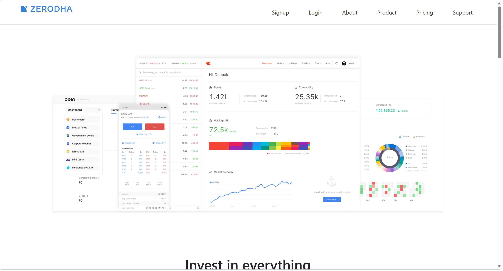
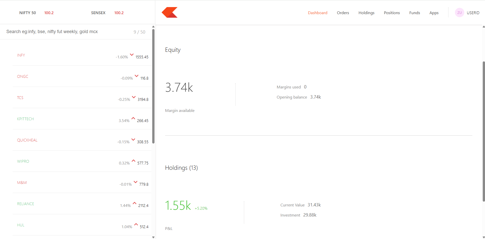
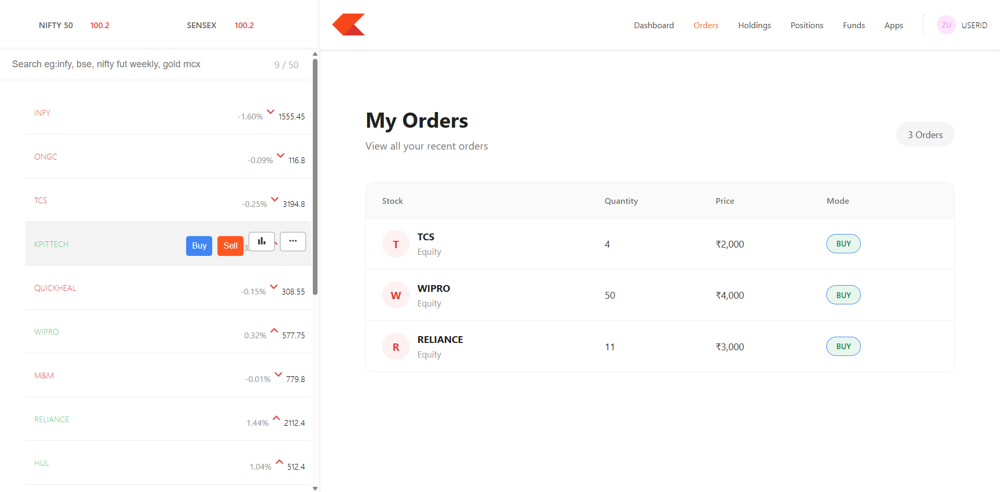
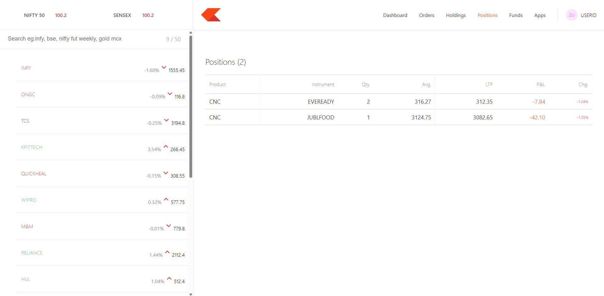

# Trade Plus

Trade Plus is a full-stack trading dashboard inspired by modern stock trading platforms. 
It allows users to view holdings, positions, orders, and interact with a trading-style interface.

## 🚀 Features

- User-friendly trading dashboard
- View stock holdings
- View positions
- Place Buy and Sell orders
- View order history
- MongoDB database integration
- REST API using Node.js and Express
- React-based frontend
- Responsive and clean UI

## 🛠️ Tech Stack

### Frontend
- React.js
- JavaScript
- HTML
- CSS
- Axios

### Backend
- Node.js
- Express.js
- MongoDB
- Mongoose

### Tools
- Git
- GitHub
- VS Code

## 📁 Project Structure

```text
trade-plus/
├── backend/
├── dashboard/
├── frontend/
├── .gitignore
└── README.md
```

## 📸 Screenshots

### Home Page


### Dashboard


### Orders


### Positions
